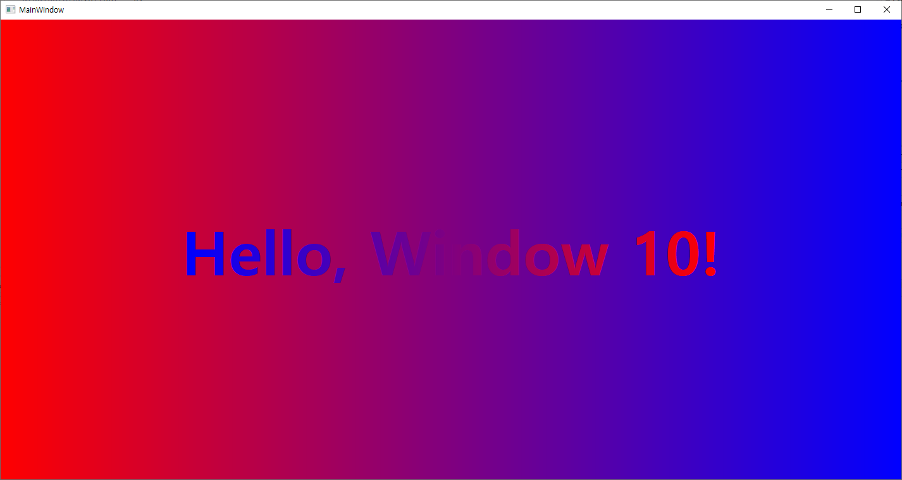
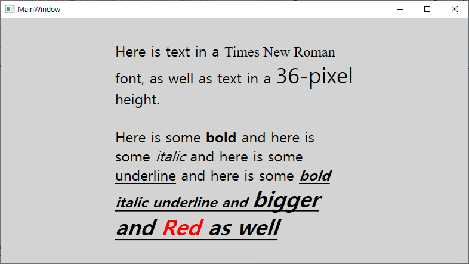
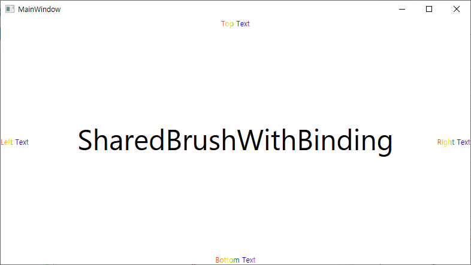

# XAML 문법

## 코드로 그라데이션 브러시 다루기

```xml
<Window x:Class="Hello.MainWindow"
        xmlns="http://schemas.microsoft.com/winfx/2006/xaml/presentation"
        xmlns:x="http://schemas.microsoft.com/winfx/2006/xaml"
        xmlns:d="http://schemas.microsoft.com/expression/blend/2008"
        xmlns:mc="http://schemas.openxmlformats.org/markup-compatibility/2006"
        xmlns:local="clr-namespace:Hello"
        mc:Ignorable="d"
        Title="MainWindow">
    <Grid x:Name="contentGrid">
        <Grid.ColumnDefinitions>
            <ColumnDefinition Width="*" />
        </Grid.ColumnDefinitions>
        <TextBlock x:Name="txtblk"
                   Grid.Column="0"
                   Text="Hello, Windows 10!"
                   FontSize="96"
                   FontWeight="Bold"
                   HorizontalAlignment="Center"
                   VerticalAlignment="Center" />
    </Grid>
</Window>
```

```csharp
using System.Windows;
using System.Windows.Media;

namespace Hello
{
    /// <summary>
    /// Interaction logic for MainWindow.xaml
    /// </summary>
    public partial class MainWindow : Window
    {
        public MainWindow()
        {
            InitializeComponent();

            LinearGradientBrush foregroundBrush = new LinearGradientBrush();
            foregroundBrush.StartPoint = new Point(0, 0);
            foregroundBrush.EndPoint = new Point(1, 0);

            GradientStop gradientStop = new GradientStop();
            gradientStop.Offset = 0;
            gradientStop.Color = Colors.Blue;
            foregroundBrush.GradientStops.Add(gradientStop);

            gradientStop = new GradientStop();
            gradientStop.Offset = 1;
            gradientStop.Color = Colors.Red;
            foregroundBrush.GradientStops.Add(gradientStop);

            txtblk.Foreground = foregroundBrush;

            LinearGradientBrush backgroundBrush = new LinearGradientBrush
            {
                StartPoint = new Point(0, 0),
                EndPoint = new Point(1, 0)
            };
            backgroundBrush.GradientStops.Add(new GradientStop
            {
                Offset = 0,
                Color = Colors.Red
            });
            backgroundBrush.GradientStops.Add(new GradientStop
            {
                Offset = 1,
                Color = Colors.Blue
            });

            contentGrid.Background = backgroundBrush;
        }
    }
}
```

결과



## 속성 엘리먼트 문법

**Foreground** 속성을 **SolidColorBrush** 의 인스턴스로 설정되는 것을 명시적으로 드러나게 하기.
```xml
<TextBlock Text="Hello, Windows 10!" FontSize="96">
    <TextBlock.Foreground>
        <SolidColorBrush Color="Blue" />
    </TextBlock.Foreground>
</TextBlock>
```

- **TextBlock**과 **SolidColorBrush**는 모두 "개체 엘리먼트 (Object Elements)"의 예다. 개체를 생성하는 XML 엘리먼트이기 때문이다.
- **Text**, **FontSize**, **Color**는 "속성 어트리뷰트(Property Attributes)"의 예다. 속성의 설정을 지정하는 XML 어트리뷰트이기 때문이다.
- **TextBlock.Foreground** 태그는 "속성 엘리먼트(Property Element)"이다. XML 엘리먼트로 표현하는 속성이다.

```xml
<Window x:Class="Hello_XMAL.MainWindow"
        xmlns="http://schemas.microsoft.com/winfx/2006/xaml/presentation"
        xmlns:x="http://schemas.microsoft.com/winfx/2006/xaml"
        xmlns:d="http://schemas.microsoft.com/expression/blend/2008"
        xmlns:mc="http://schemas.openxmlformats.org/markup-compatibility/2006"
        xmlns:local="clr-namespace:Hello_XMAL"
        mc:Ignorable="d"
        Title="MainWindow">
    <Grid x:Name="contentGrid">
        <Grid.ColumnDefinitions>
            <ColumnDefinition Width="*" />
        </Grid.ColumnDefinitions>

        <Grid.Background>
            <LinearGradientBrush StartPoint="0 0" EndPoint="1 0" >
                <LinearGradientBrush.GradientStops>
                    <GradientStopCollection>
                        <GradientStop Offset="0" Color="Red" />
                        <GradientStop Offset="1" Color="Blue" />
                    </GradientStopCollection>
                </LinearGradientBrush.GradientStops>
            </LinearGradientBrush>
        </Grid.Background>

        <TextBlock Text="Hello, Windows 10!"
                   FontSize="96"
                   HorizontalAlignment="Center"
                   VerticalAlignment="Center">
            <TextBlock.Foreground>
                <LinearGradientBrush StartPoint="0 0" EndPoint="1 0">
                    <LinearGradientBrush.GradientStops>
                        <GradientStopCollection>
                            <GradientStop Offset="0" Color="Blue" />
                            <GradientStop Offset="1" Color="Red" />
                        </GradientStopCollection>
                    </LinearGradientBrush.GradientStops>
                </LinearGradientBrush>
            </TextBlock.Foreground>
        </TextBlock>
    </Grid>
</Window>
```

첫번째 예제와 동일한 코드를 XAML 로 구현.


## Content 속성

XAML 에서 참조하는 모든 클래스들은 **Content** 속성으로 설계된 단 하나의 속성을 가지는 것이 허용된다. <u>**오직 이 콘텐트 속성만이 속성 엘리먼트 태그가 필요하지 않다.**</u>

특정 클래스에 대한 콘텐츠 속성은 닷넷 어트리뷰트로 지정되어 있음.
Grid에서 파생된 Panel 클래스의 실제 클래스 정의의 어딘가에 **ContentProperty** 라는 어트리뷰트가 있다. 이러한 클래스가 C#으로 정의되었다면 다음과 깉이 보일 것이다.
```csharp
[ContentProperty(Name="Children")]
public class Panel : FrameworkElement
{
    ...
}
```

위의 코드 블럭이 의미하는 바는 단순히, XAML 파서가 다음과 같은 마크업을 만날 때마다,
```xml
<Grid ...>
    <TextBlock ... />
    <TextBlock ... />
    <TextBlock ... />
</Grid>
```
Grid의 **ContentProperty** 속성을 확인하고 이 TextBlock 엘리먼트들이 Children 속성에 추가되도록 한다.


## TextBlock의 콘텐츠 속성
- **TextBlock**은 텍스트를 콘텐츠로 지정할 수 있지만, **TextBlock**의 콘텐츠 속성은 **Text** 속성은 아니다.
- **Inline** 개체의 컬렉션인 **InlineCollection** 형식의 **Inlines** 라는 속성이며, 더 정확히 말하자면 **Inline**에서 파생된 클래스의 인스턴스다.
- 하나의 **TextBlock**에 여러 가지의 서식 있는 텍스트를 지정할 수 있도록 해 준다.
- **Run** 엘리먼트는 Text 속성을 정의하는 데만 사용되는 클래스이며 콘텐츠 속성이다.
    - **InlineCollection**의 모든 텍스트 콘텐츠는 해당 텍스트가 이미 Run의 콘텐츠인 경우를 제외하고는 Run으로 변환된다.
    - 텍스트 문자열의 다른 폰트 속성을 명시적으로 지정하기 위해 Run 개체를 사용할 수 있다.

```xml
<Window x:Class="TextFormatting.MainWindow"
        xmlns="http://schemas.microsoft.com/winfx/2006/xaml/presentation"
        xmlns:x="http://schemas.microsoft.com/winfx/2006/xaml"
        xmlns:d="http://schemas.microsoft.com/expression/blend/2008"
        xmlns:mc="http://schemas.openxmlformats.org/markup-compatibility/2006"
        xmlns:local="clr-namespace:TextFormatting"
        mc:Ignorable="d"
        Title="MainWindow" Height="450" Width="800">
    <Window.Resources>
        <SolidColorBrush x:Key="WindowBrush" Color="LightGray" />
    </Window.Resources>

    <Grid Background="{DynamicResource WindowBrush}">
        <TextBlock Width="400"
                   FontSize="24"
                   TextWrapping="Wrap"
                   HorizontalAlignment="Center"
                   VerticalAlignment="Center">
            Here is text in a
            <Run FontFamily="Times New Roman">Times New Roman</Run> font, as well as text in a
            <Run FontSize="36">36-pixel</Run> height.
            <LineBreak />
            <LineBreak />
            Here is some <Bold>bold</Bold> and here is some
            <Italic>italic</Italic> and here is some
            <Underline>underline</Underline> and here is some
            <Bold><Italic><Underline>bold italic underline and
                <Span FontSize="36">bigger and
                <Span Foreground="Red">Red</Span> as well</Span>
            </Underline></Italic></Bold>
        </TextBlock>
    </Grid>
</Window>
```
결과


## 데이터 바인딩 맛보기
- 기본적으로 데이터 바인딩은 서로 다른 객체들의 두 속성들 간의 연결을 구성한다.
- 데이터 원본을 가진 페이지에 존재하는 비주얼 엘리먼트들을 연결하는 최적의 응용 프로그램을 찾으며, 인기있는 MVVM 아키텍처 패턴을 구현하는 중요한 부분을 구성한다.
    - MVVM에서 바인딩의 대상은 View의 비주얼 엘리먼트이며, 바인딩의 소스는 View 모델에 대응하는 속성이다.

```xml
<Window x:Class="SharedBrushWithBinding.MainWindow"
        xmlns="http://schemas.microsoft.com/winfx/2006/xaml/presentation"
        xmlns:x="http://schemas.microsoft.com/winfx/2006/xaml"
        xmlns:d="http://schemas.microsoft.com/expression/blend/2008"
        xmlns:mc="http://schemas.openxmlformats.org/markup-compatibility/2006"
        xmlns:local="clr-namespace:SharedBrushWithBinding"
        mc:Ignorable="d"
        Title="MainWindow" Height="450" Width="800">
    <Grid>
        <TextBlock Text="SharedBrushWithBinding"
                   FontFamily="Portable User Interface"
                   FontSize="48"
                   HorizontalAlignment="Center"
                   VerticalAlignment="Center" />

        <TextBlock x:Name="topTextBlock"
                   Text="Top Text"
                   HorizontalAlignment="Center"
                   VerticalAlignment="Top">
            <TextBlock.Foreground>
                <LinearGradientBrush>
                    <GradientStop Offset="0" Color="Red" />
                    <GradientStop Offset="0.17" Color="Orange" />
                    <GradientStop Offset="0.33" Color="Yellow" />
                    <GradientStop Offset="0.5" Color="Green" />
                    <GradientStop Offset="0.67" Color="Blue" />
                    <GradientStop Offset="0.83" Color="Indigo" />
                    <GradientStop Offset="1" Color="Violet" />
                </LinearGradientBrush>
            </TextBlock.Foreground>
        </TextBlock>

        <TextBlock Text="Left Text"
                   HorizontalAlignment="Left"
                   VerticalAlignment="Center"
                   Foreground="{Binding ElementName=topTextBlock, Path=Foreground}" />

        <TextBlock Text="Right Text"
                   HorizontalAlignment="Right"
                   VerticalAlignment="Center"
                   Foreground="{Binding ElementName=topTextBlock, Path=Foreground}" />

        <TextBlock Text="Bottom Text"
                   HorizontalAlignment="Center"
                   VerticalAlignment="Bottom">
            <TextBlock.Foreground>
                <Binding ElementName="topTextBlock" Path="Foreground" />
            </TextBlock.Foreground>
        </TextBlock>
    </Grid>
</Window>

```

결과


- 데이터 바인딩은 흔히 하나의 소스와 하나의 대상을 가지고 있다.
    - 대상은 항상 그 바인딩이 설정될 속성
    - 소스는 그 바인딩이 참조하는 속성
    - **topTextBlock** 이라는 **TextBlock**은 바인딩의 소스
    - **Foreground** 속성을 공유하는 세 개의 **TextBlock** 엘리먼트들이 대상
- XAML 마크업 확장은 항상 중괄호 안에 표시된다.
    `Foreground="{Binding ElementName=topTextBlock, Path=Foreground}"`
    - **ElementName** 속성은 원하는 속성이 설정되어 있는 엘리먼트의 이름을 지정한다.
    - **Path**가 속성의 이름을 제공한다.
