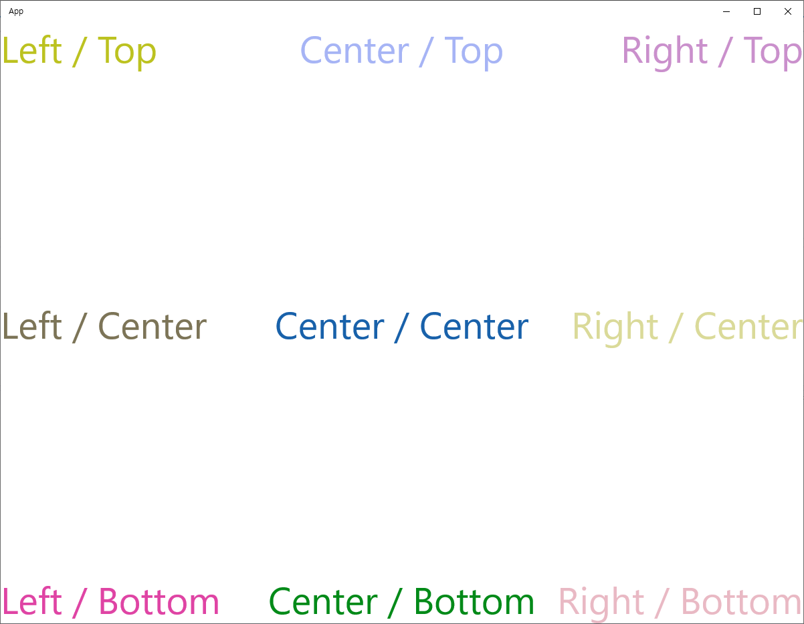

# 기본적인 이벤트 처리

> 이벤트는 첫 번째 객체로부터 "발생(fire, raised)" 또는 "트리거(triggered)" 되며, 다른 객체에서 "처리(handled)"된다고 주로 표현한다.
> 일반적으로 윈도우 런타임 프로그램은 초기화 이후 메모리에 상주하며 어떤 일이 발생하기를 기다린다.
> 그 후 거의 대부분이 프로그램이 하는 작업은 발생한 이벤트에 응답하는 것이다.

## Tapped 이벤트
**UIElement** 클래스는 모든 기본적인 입력 이벤트에 대해 정의하고 있다.
- **Pointer**라는 단어로 시작하는 8개의 이벤트. 이 이벤트들은 터치, 마우스, 펜 등으로부터 유입되는 입력을 통합한다.
- **Manipulation** 이라는 단어로 시작하는 5개의 이벤트. 이 이벤트들은 손가락으로부터의 입력을 조합해준다.
- **Key** 이벤트 2개는 키보드 입력을 제어한다.
- 더 높은 수준의 이벤트로 **Tapped, DoubleTapped, RightTapped, Holding**이라는 이벤트도 있다.

**UIElement** 클래스에서 유일하게 정의하는 다른 이벤트들도 마찬가지로 사용자 입력과 관련이 있다.
- **GotFocus, LostFocus** 이벤트는 엘리먼트가 키보드 입력의 대상일 때 발생함.
- **DragEnter, DragOver, DragLeave, Drop** 이벤트는 드래그 앤 드롭과 관련이 있다.

```csharp
public event TappedEventHandler Tapped;
```

```csharp
public delegate void TappedEventHandler(object sender, TappedRoutedEventArgs e);
```
- `sender` 는 이벤트가 발생한 출처.
- `e`는 Tapped 이벤트에 명시된 속성과 메서드를 제공함.

```xml
<Page
    x:Class="App.MainPage"
    xmlns="http://schemas.microsoft.com/winfx/2006/xaml/presentation"
    xmlns:x="http://schemas.microsoft.com/winfx/2006/xaml"
    xmlns:local="using:App"
    xmlns:d="http://schemas.microsoft.com/expression/blend/2008"
    xmlns:mc="http://schemas.openxmlformats.org/markup-compatibility/2006"
    mc:Ignorable="d"
    Background="{ThemeResource ApplicationPageBackgroundThemeBrush}">

    <Grid>
        <TextBlock x:Name="txtblk"
                   Text="Tap Text!"
                   FontSize="96"
                   HorizontalAlignment="Center"
                   VerticalAlignment="Center"
                   Tapped="txtblk_Tapped" />
    </Grid>
</Page>
```
```cs
using System;
using System.Drawing;
using Windows.UI.Xaml.Controls;
using Windows.UI.Xaml.Input;
using Windows.UI.Xaml.Media;

// The Blank Page item template is documented at https://go.microsoft.com/fwlink/?LinkId=402352&clcid=0x409

namespace App
{
    /// <summary>
    /// An empty page that can be used on its own or navigated to within a Frame.
    /// </summary>
    public sealed partial class MainPage : Page
    {
        Random rand = new Random();
        byte[] rgb = new byte[3];

        public MainPage()
        {
            this.InitializeComponent();
        }

        private void txtblk_Tapped(object sender, TappedRoutedEventArgs e)
        {
            rand.NextBytes(rgb);
            Windows.UI.Color clr = Windows.UI.Color.FromArgb(255, rgb[0], rgb[1], rgb[2]);
            txtblk.Foreground = new SolidColorBrush(clr);
        }
    }
}
```

## 라우트된 이벤트 처리
- Tapped 이벤트 핸들러의 첫 번째 인수가 이벤트를 발생시키는 엘리먼트이기 때문에 `TextBlock`에 굳이 이름을 부여하지 않아도 이벤트 핸들러 내부에서 `TextBlock` 엘리먼트에 대한 접근이 가능함.
- 엘리먼트에 이름을 부여하는 대신, `sender` 인수를 `TextBlock`의 객체 타입으로 형변환 시킴으로써 접근성 문제를 간단히 해결 할 수 있음.
- 엘리먼트들 간에 이벤트 핸들러를 공유하는데 있어서 특히 유영함.
- `FontSize`가 모든 `TextBlock` 엘리먼트들로부터 상속을 받기 위해 `Page` 엘리먼트 내부에 설정되어 있음.

```xml
<Page
    x:Class="App.MainPage"
    xmlns="http://schemas.microsoft.com/winfx/2006/xaml/presentation"
    xmlns:x="http://schemas.microsoft.com/winfx/2006/xaml"
    xmlns:local="using:App"
    xmlns:d="http://schemas.microsoft.com/expression/blend/2008"
    xmlns:mc="http://schemas.openxmlformats.org/markup-compatibility/2006"
    mc:Ignorable="d"
    Background="{ThemeResource ApplicationPageBackgroundThemeBrush}"
    FontSize="48" >

    <Grid>
        <TextBlock Text="Left / Top" HorizontalAlignment="Left" VerticalAlignment="Top" Tapped="OnTextBlockTapped" />
        <TextBlock Text="Center / Top" HorizontalAlignment="Center" VerticalAlignment="Top" Tapped="OnTextBlockTapped" />
        <TextBlock Text="Right / Top" HorizontalAlignment="Right" VerticalAlignment="Top" Tapped="OnTextBlockTapped" />
        <TextBlock Text="Left / Center" HorizontalAlignment="Left" VerticalAlignment="Center" Tapped="OnTextBlockTapped" />
        <TextBlock Text="Center / Center" HorizontalAlignment="Center" VerticalAlignment="Center" Tapped="OnTextBlockTapped" />
        <TextBlock Text="Right / Center" HorizontalAlignment="Right" VerticalAlignment="Center" Tapped="OnTextBlockTapped" />
        <TextBlock Text="Left / Bottom" HorizontalAlignment="Left" VerticalAlignment="Bottom" Tapped="OnTextBlockTapped" />
        <TextBlock Text="Center / Bottom" HorizontalAlignment="Center" VerticalAlignment="Bottom" Tapped="OnTextBlockTapped" />
        <TextBlock Text="Right / Bottom" HorizontalAlignment="Right" VerticalAlignment="Bottom" Tapped="OnTextBlockTapped" />
    </Grid>
</Page>
```
```cs
using System;
using Windows.UI;
using Windows.UI.Xaml.Controls;
using Windows.UI.Xaml.Input;
using Windows.UI.Xaml.Media;

// The Blank Page item template is documented at https://go.microsoft.com/fwlink/?LinkId=402352&clcid=0x409

namespace App
{
    /// <summary>
    /// An empty page that can be used on its own or navigated to within a Frame.
    /// </summary>
    public sealed partial class MainPage : Page
    {
        Random rand = new Random();
        byte[] rgb = new byte[3];

        public MainPage()
        {
            this.InitializeComponent();
        }

        private void OnTextBlockTapped(object sender, TappedRoutedEventArgs e)
        {
            TextBlock txtblk = sender as TextBlock;
            rand.NextBytes(rgb);
            Color clr = Color.FromArgb(255, rgb[0], rgb[1], rgb[2]);
            txtblk.Foreground = new SolidColorBrush(clr);
        }
    }
}
```
결과


### 라우트된 입력 처리란?
- 어느 엘리먼트에 의해 발생된 입력 이벤트(예를 들어 Tapped와 같은 입력 이벤트)가 비주얼 트리 경로를 거슬러 올라가는 경우에 처리하는 방법을 설명할 때 사용하는 용어.
- Tapped 이벤트 핸들러는 별도의 `TextBlock` 엘리먼트에 정의하기 보다는 부모 레벨의 엘리먼트(예를 들어 Grid)에 정의하는 편이 낫다.

### 부모 레벨에 정의한 예제.

```xml
<Page
    x:Class="App.MainPage"
    xmlns="http://schemas.microsoft.com/winfx/2006/xaml/presentation"
    xmlns:x="http://schemas.microsoft.com/winfx/2006/xaml"
    xmlns:local="using:App"
    xmlns:d="http://schemas.microsoft.com/expression/blend/2008"
    xmlns:mc="http://schemas.openxmlformats.org/markup-compatibility/2006"
    mc:Ignorable="d"
    Background="{ThemeResource ApplicationPageBackgroundThemeBrush}"
    FontSize="48">

    <Grid Tapped="OnGridTapped">
        <TextBlock Text="Left / Top" HorizontalAlignment="Left" VerticalAlignment="Top" />
        <TextBlock Text="Center / Top" HorizontalAlignment="Center" VerticalAlignment="Top" />
        <TextBlock Text="Right / Top" HorizontalAlignment="Right" VerticalAlignment="Top" />
        <TextBlock Text="Left / Center" HorizontalAlignment="Left" VerticalAlignment="Center" />
        <TextBlock Text="Center / Center" HorizontalAlignment="Center" VerticalAlignment="Center" />
        <TextBlock Text="Right / Center" HorizontalAlignment="Right" VerticalAlignment="Center" />
        <TextBlock Text="Left / Bottom" HorizontalAlignment="Left" VerticalAlignment="Bottom" />
        <TextBlock Text="Center / Bottom" HorizontalAlignment="Center" VerticalAlignment="Bottom" />
        <TextBlock Text="Right / Bottom" HorizontalAlignment="Right" VerticalAlignment="Bottom" />
    </Grid>
</Page>
```

```cs
using System;
using Windows.UI;
using Windows.UI.Xaml.Controls;
using Windows.UI.Xaml.Input;
using Windows.UI.Xaml.Media;

// The Blank Page item template is documented at https://go.microsoft.com/fwlink/?LinkId=402352&clcid=0x409

namespace App
{
    /// <summary>
    /// An empty page that can be used on its own or navigated to within a Frame.
    /// </summary>
    public sealed partial class MainPage : Page
    {
        Random rand = new Random();
        byte[] rgb = new byte[3];

        public MainPage()
        {
            this.InitializeComponent();
        }

        private void OnGridTapped(object sender, TappedRoutedEventArgs args)
        {
            if (args.OriginalSource is TextBlock)
            {
                TextBlock txtblk = args.OriginalSource as TextBlock;
                rand.NextBytes(rgb);
                Color clr = Color.FromArgb(255, rgb[0], rgb[1], rgb[2]);
                txtblk.Foreground = new SolidColorBrush(clr);
            }
        }
    }
}
```

- `OriginalSource` 속성은 이벤트의 원천을 가리킨다.
- 이 예제에서 `OriginalSource`의 값은 `TextBlock` 일 수도 있고, `Grid` 일 수도 있기 때문에 반드시 형 변환 여부를 확인해야 함.


### UIElement 로 정의된 Tapped 이벤트

```xml
<Page
    x:Class="App.MainPage"
    xmlns="http://schemas.microsoft.com/winfx/2006/xaml/presentation"
    xmlns:x="http://schemas.microsoft.com/winfx/2006/xaml"
    xmlns:local="using:App"
    xmlns:d="http://schemas.microsoft.com/expression/blend/2008"
    xmlns:mc="http://schemas.openxmlformats.org/markup-compatibility/2006"
    mc:Ignorable="d"
    Background="{ThemeResource ApplicationPageBackgroundThemeBrush}"
    FontSize="48">

    <Grid>
        <TextBlock Text="Left / Top" HorizontalAlignment="Left" VerticalAlignment="Top" />
        <TextBlock Text="Center / Top" HorizontalAlignment="Center" VerticalAlignment="Top" />
        <TextBlock Text="Right / Top" HorizontalAlignment="Right" VerticalAlignment="Top" />
        <TextBlock Text="Left / Center" HorizontalAlignment="Left" VerticalAlignment="Center" />
        <TextBlock Text="Center / Center" HorizontalAlignment="Center" VerticalAlignment="Center" />
        <TextBlock Text="Right / Center" HorizontalAlignment="Right" VerticalAlignment="Center" />
        <TextBlock Text="Left / Bottom" HorizontalAlignment="Left" VerticalAlignment="Bottom" />
        <TextBlock Text="Center / Bottom" HorizontalAlignment="Center" VerticalAlignment="Bottom" />
        <TextBlock Text="Right / Bottom" HorizontalAlignment="Right" VerticalAlignment="Bottom" />
    </Grid>
</Page>
```

```cs
using System;
using Windows.UI;
using Windows.UI.Xaml.Controls;
using Windows.UI.Xaml.Input;
using Windows.UI.Xaml.Media;

// The Blank Page item template is documented at https://go.microsoft.com/fwlink/?LinkId=402352&clcid=0x409

namespace App
{
    /// <summary>
    /// An empty page that can be used on its own or navigated to within a Frame.
    /// </summary>
    public sealed partial class MainPage : Page
    {
        Random rand = new Random();
        byte[] rgb = new byte[3];

        public MainPage()
        {
            this.InitializeComponent();
        }

        protected override void OnTapped(TappedRoutedEventArgs args)
        {
            if (args.OriginalSource is TextBlock)
            {
                TextBlock txtblk = args.OriginalSource as TextBlock;
                rand.NextBytes(rgb);
                Color clr = Color.FromArgb(255, rgb[0], rgb[1], rgb[2]);
                txtblk.Foreground = new SolidColorBrush(clr);
            }

            base.OnTapped(args);
        }
    }
}
```